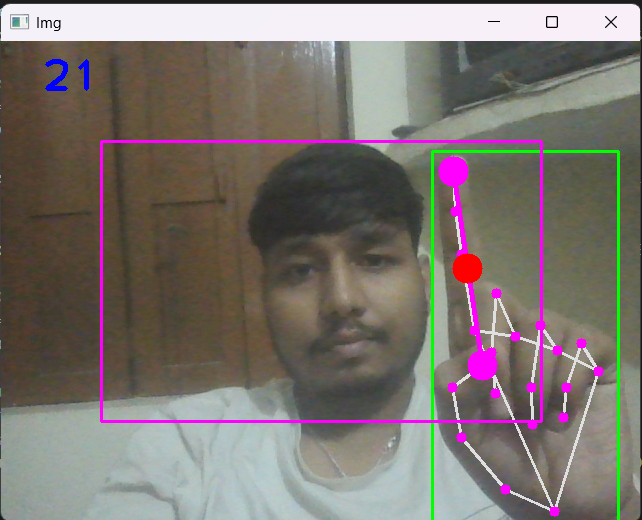

# AI Virtual Mouse 🖱️

Control your computer mouse using hand gestures with AI-powered computer vision.

## Demo 📸


*Screenshot showing the AI Virtual Mouse application in action with hand gesture recognition*

## Video Demo 🎥

### Watch the AI Virtual Mouse in Action!

[](https://github.com/Aditya-Kumar-Singh-007/AI_Virtual_Mouse/blob/main/VIDEO.mp4)

*Click the button above to watch the complete demonstration*

**What you'll see in the video:**
- ✋ Hand gesture recognition in real-time
- 🖱️ Cursor movement with index finger
- 🖱️ Left and right click demonstrations
- 🔊 Volume control with fist gestures
- 💡 Brightness control with pinky finger
- 📜 Scroll functionality with thumb

> **Note**: GitHub doesn't support embedded video playback in README. Click the button above to view the video file directly.

## Features 🎮

- **👆 Cursor Movement**: Point with index finger to move cursor
- **✌️ Left Click**: Bring index and middle fingers together
- **👍 Right Click**: Bring thumb and index finger together
- **✊ Volume Control**: Make fist and move up/down to adjust volume
- **🤙 Brightness Control**: Raise only pinky and move up/down
- **👍 Scroll**: Raise only thumb and move up/down to scroll
- **🖐️ No Action**: Open all fingers for safe mode

## Installation 📦

1. Clone the repository:
```bash
git clone https://github.com/Aditya-Kumar-Singh-007/AI_Virtual_Mouse.git
cd AI_Virtual_Mouse
```

2. Install dependencies:
```bash
pip install -r requirements.txt
```

## Usage 🚀

Run the application:
```bash
python Aivirtual.py
```

**Exit Options:**
- Press 'Q' to quit
- Press 'ESC' to exit
- Click X button on window

## Requirements 📋

- Python 3.7+
- Webcam
- Windows OS (for volume/brightness control)

## Dependencies 🔧

- OpenCV
- MediaPipe
- AutoPy
- NumPy
- PyCaw (for volume control)

## How It Works 🔍

The application uses MediaPipe for hand tracking and gesture recognition. Different finger combinations trigger various mouse actions:

1. **Movement**: Index finger position maps to cursor movement
2. **Clicks**: Finger proximity detection triggers clicks
3. **System Controls**: Hand gestures control volume and brightness
4. **Scrolling**: Thumb position controls scroll direction

## Troubleshooting 🛠️

- Ensure good lighting for better hand detection
- Keep hand within the purple rectangle frame
- Adjust camera position for optimal tracking
- Make sure webcam permissions are enabled

## Contributing 🤝

Feel free to submit issues and enhancement requests!

## License 📄

This project is open source and available under the MIT License.